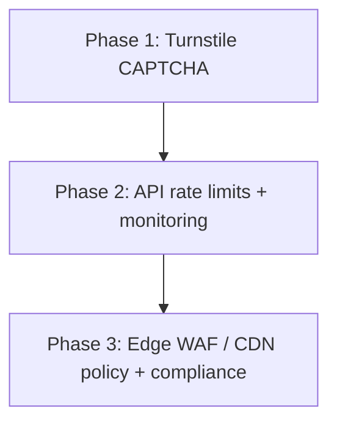

# Auth bot protection — Turnstile & edge security plan

Phased plan for reducing automated abuse on login and related auth flows.
Companion to [`AUTH_SIGN_UP_API.md`](./AUTH_SIGN_UP_API.md).

**Current state:** No CAPTCHA or bot checks. Auth calls `POST /api/auth` from the FE
(`LoginPage.jsx`, signup, forgot-password). Static app is served via **AWS CloudFront +
S3** ([`DEPLOYMENT.md`](../DEPLOYMENT.md)).

---
## Scope clarification

| Product | Phase 1? | Notes |
|---------|----------|--------|
| **Cloudflare Turnstile** (CAPTCHA widget + siteverify API) | **Yes** | Standalone; does **not** require proxying the site through Cloudflare. |
| **Cloudflare CDN / DNS / WAF** (orange-cloud proxy, zone plans) | **No** | Deferred to Phase 3 (optional). AWS CloudFront remains the CDN. |

Turnstile is made by Cloudflare, but using it is **not** the same as putting the whole
app behind Cloudflare. Phase 1 is **CAPTCHA only**.

---

## Phase 1 — Turnstile on auth forms

**Goal:** Block naive bots and scripted credential stuffing on sensitive forms.

**Estimated cost:** $0 (Turnstile [free plan](https://developers.cloudflare.com/turnstile/plans/)).

### Is Phase 1 FE-only?

**No — not for production.**

A Turnstile token from the browser is easy to forge or replay. **Security requires
server-side verification** before any auth action runs (sign-in, sign-up,
forgot-password).

| Approach | Blocks real bots? | Ship? |
|----------|-------------------|-------|
| FE widget only (token never checked) | No | **Do not ship** |
| FE widget + BE verifies token with Cloudflare `siteverify` | Yes (for automated abuse at this layer) | **Required minimum** |

### Phase 1a — Beta soft rollout (verify-if-present) — **BE shipped**

Because beta/stable is only known **after** login (`GET /api/me/entitlements` needs a
JWT), the cohort cannot be resolved at the pre-auth `POST /api/auth` endpoints. Rollout
is therefore driven by the **FE route**, not by server-side cohort lookup:

- **Beta login page** (temporary, unlinked route) renders the widget and sends
  `turnstileToken` (+ optional `channel: 'beta'`).
- **Main login page** sends no token (optionally `channel: 'stable'`).
- **BE = verify-if-present:** if `turnstileToken` is present it is verified via
  `siteverify` and rejected on failure (fail closed); if absent, sign-in proceeds
  unverified. This is a **dogfood harness, not enforcement** — a bot can still use the
  main page. Real protection = Phase 1b (require token for all).

> `channel` is for logging/metrics only and must never decide whether verification
> runs — a client could forge it. **Token presence is the signal.**

**BE status (this repo):**

- [x] Env var name chosen: **`CLOUDFLARE_TURNSTILE_SECRET_KEY`** (falls back to
  `TURNSTILE_SECRET_KEY`). In `.env.local` + `deploy.yml` (needs matching GitHub secret).
- [x] `src/utils/turnstile.js` — `verifyTurnstile()` (siteverify, timeout, fail closed,
  optional `expectedAction` binding).
- [x] `authSignInRequestSchema` / `authSignUpRequestSchema` /
  `authForgotPasswordRequestSchema` — **required** `turnstileToken`, optional `channel`.
- [x] `src/fastify/routes/auth.js` `sign-in`, `sign-up`, `forgot-password` — require a
  valid token and validate the Turnstile `action` matches the flow before invoking the
  controller (**enforcement, Phase 1b**, no longer verify-if-present).
  Authenticated actions (`sign-out`, `check-validity`) and
  `POST /auth/change-password` do **not** use Turnstile.
- [x] `tests/turnstile.unit.test.js` (in `npm run test:unit`).
- [ ] Add `CLOUDFLARE_TURNSTILE_SECRET_KEY` to GitHub Actions secrets.

**FE follow-up (other repo, to convey):** temporary beta login route that renders the
widget (`VITE_TURNSTILE_SITE_KEY`) and passes `turnstileToken` through `api.signIn`;
main login unchanged.

**Phase 1 deliverables (both repos):**

#### Frontend (`enscribe-web`)

- [ ] Cloudflare Turnstile dashboard: create site, get **site key** (public) and **secret key** (server only).
- [ ] Add Turnstile script/widget on:
  - `src/pages/LoginPage.jsx` — `action: sign-in`
  - Signup page — `action: sign-up`
  - Forgot-password flow — `action: forgot-password`
- [ ] On submit, include the token in the auth request body (e.g. `turnstileToken` — exact field name agreed with BE).
- [ ] Disable submit until widget succeeds (or show error on expired token / retry).
- [ ] Env: `VITE_TURNSTILE_SITE_KEY` (public, safe in build).

#### Backend (auth API — separate service/repo)

- [ ] Store `TURNSTILE_SECRET_KEY` in secrets (never in FE or git).
- [ ] On `POST /api/auth` for `sign-in`, `sign-up`, `forgot-password`:
  1. Require non-empty `turnstileToken`.
  2. `POST https://challenges.cloudflare.com/turnstile/v0/siteverify` with secret + token (+ optional `remoteip`).
  3. If `success !== true`, return **4xx** (generic message; do not leak Turnstile internals to clients).
  4. Only then run existing Supabase/auth logic.
- [ ] Document new request field in `AUTH_SIGN_UP_API.md` (or BE OpenAPI).
- [ ] Local/dev: Turnstile test keys from Cloudflare docs, or bypass flag **only** in non-prod (never in production).

#### FE API client (`src/lib/api.js`)

- [ ] `signIn`, `signUp`, `forgotPassword` (and any other protected actions) pass `turnstileToken` in JSON body.

### Phase 1 — Out of scope

- Cloudflare zone / orange-cloud proxy
- AWS WAF rule changes
- Per-IP rate limits (Phase 2)
- HIPAA BAA review with Cloudflare (track in Phase 3 if needed)

### Phase 1 — Test plan

1. Login without token → BE rejects.
2. Login with invalid/expired token → BE rejects.
3. Login with valid token → existing auth behavior unchanged.
4. Widget failure / ad-block → user sees clear error, no silent bypass.
5. Signup and forgot-password same as login.

---

## Phase 2 — Auth rate limiting & abuse controls (no Cloudflare CDN)

**Goal:** Limit brute force and mail floods even if CAPTCHA is solved or bypassed.

**Still no Cloudflare CDN** — implement at the **API layer** (and optionally AWS in front
of the API).

### Recommended work

| Control | Where | Notes |
|---------|--------|--------|
| Rate limit by IP | API gateway or Fastify middleware | e.g. N attempts per minute on `POST /api/auth` per `action` |
| Stricter limit on `forgot-password` | Same | Reduces email abuse / enumeration noise |
| Stricter limit on `sign-up` | Same | Reduces fake account creation |
| Structured logging | BE | Log rate-limit hits and failed Turnstile (no passwords in logs) |
| Alerts | Ops | Spike in 401/429 on `/api/auth` |

### Optional (same phase)

- [ ] Account-level lockout or exponential backoff after repeated failed sign-in (BE + Supabase policies).
- [ ] CAPTCHA required only after N failures per IP (reduces friction for humans) — needs BE state.

### Phase 2 — FE role

Minimal: handle **429** / “too many attempts” messages on login and related pages.
No new third-party widgets.

### Phase 2 — Cost

Typically **$0** extra if implemented in existing API host or AWS API Gateway throttling
(already in your AWS bill).

---

## Phase 3 — Edge WAF, CDN strategy, compliance (optional)

**Goal:** DDoS/bot scoring at the edge, unified security policy, production compliance
for a healthcare-adjacent product.

Choose **one** primary edge story unless there is a strong reason for both:

| Option A | Option B |
|----------|----------|
| Stay on **AWS CloudFront** + **AWS WAF** on distribution/API | Move **DNS to Cloudflare**, proxy traffic (orange cloud), use **Pro/Business** WAF + bot rules |

Phase 3 is when **Cloudflare as a zone/CDN vendor** becomes relevant (~$0 Free,
~$20–25/mo Pro, ~$200–250/mo Business per domain — confirm current pricing on
[cloudflare.com/plans](https://www.cloudflare.com/plans/)).

### Phase 3 checklist

- [ ] Decision: AWS WAF vs Cloudflare proxy (avoid double-CDN complexity without reason).
- [ ] WAF managed rules for common attacks; custom rules for `/api/auth` if exposed on same hostname.
- [ ] Bot Fight Mode / Bot Management (paid tiers on Cloudflare; AWS has bot control on WAF).
- [ ] Review **BAA / subprocessors** for Turnstile + any edge vendor if PHI or strict HIPAA posture applies (Turnstile sees challenge metadata, not chart content — still document in risk register).
- [ ] Staging environment parity for WAF rules (avoid “works locally, blocked in prod”).

### Phase 3 — FE role

Usually none beyond ensuring API base URL and cookies still work behind new edge config
(cors, `SameSite`, custom domain).

---

## Summary timeline

| Phase | Cloudflare CDN? | Turnstile? | BE required? | FE required? |
|-------|-----------------|------------|--------------|--------------|
| **1** | No | Yes | **Yes** (siteverify) | Yes (widget + token in body) |
| **2** | No | Keep from Phase 1 | **Yes** (rate limits) | Small (error UX) |
| **3** | Optional | Keep | **Yes** (WAF/DNS) | Rare (config only) |

---

## Environment variables (reference)

| Variable | Where | Phase |
|----------|--------|-------|
| `VITE_TURNSTILE_SITE_KEY` | FE build | 1 |
| `CLOUDFLARE_TURNSTILE_SECRET_KEY` (fallback `TURNSTILE_SECRET_KEY`) | BE secrets | 1 |
| `CLOUDFLARE_TURNSTILE_TEST_BYPASS_TOKEN` | BE **non-prod only** (`.env.local`) | 1 |
| Rate-limit config (thresholds, Redis if used) | BE | 2 |
| WAF / Cloudflare zone IDs | Infra | 3 |

> **`CLOUDFLARE_TURNSTILE_TEST_BYPASS_TOKEN`** lets integration tests (which hit a live server
> and cannot solve a real challenge) pass a fixed token that `verifyTurnstile`
> accepts. It is honored **only when `NODE_ENV !== 'production'`** and must never be
> set in production (it is intentionally absent from `deploy.yml`). Both the server
> and the test suite read this same variable from `.env.local`.

---

## Open decisions

1. **Exact JSON field name** for the token (`turnstileToken` vs `cf-turnstile-response`) — align FE + BE in one PR pair.
2. **Fail closed in prod:** missing secret or verify API down → reject auth vs allow (recommend reject).
3. **Phase 3 vendor:** AWS WAF only vs add Cloudflare proxy — depends on ops preference and existing AWS investment.

---

## Links

- [Turnstile docs](https://developers.cloudflare.com/turnstile/)
- [Server-side validation](https://developers.cloudflare.com/turnstile/get-started/server-side-validation/)
- [Turnstile plans (pricing)](https://developers.cloudflare.com/turnstile/plans/)
- EnScribe auth API: [`AUTH_SIGN_UP_API.md`](./AUTH_SIGN_UP_API.md)
