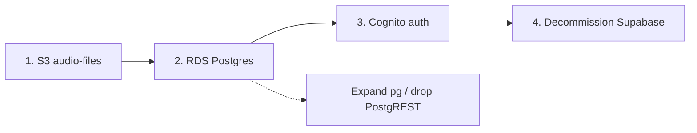

# Supabase → AWS migration feasibility

Assessment of moving Enscribe off Supabase onto AWS (RDS, S3, auth). Includes a focused comparison of **Amazon Cognito User Pools** vs **custom JWT auth on EC2**.

**Scope:** `enscribe-api` (Fastify API). Frontend (`enscribe-web`) is referenced where the API contract implies client changes, but was not audited in this repo.

**Status (July 2026):** **Step 1 (Storage → S3) complete.** **Step 2 (Postgres → RDS) tentative** — cutover done; monitoring for user-reported errors — see [RDS_POSTGRES_MIGRATION.md](./RDS_POSTGRES_MIGRATION.md). **Step 3 (Auth → Cognito) is next** — begin infra + dev-pool code while RDS stabilizes; prod auth cutover after RDS confidence window — see [COGNITO_AUTH_MIGRATION.md](./COGNITO_AUTH_MIGRATION.md).

**Related walkthroughs:**

| Step | Doc | Status |
|------|-----|--------|
| 1. Live recordings storage | [S3_AUDIO_FILES_MIGRATION.md](./S3_AUDIO_FILES_MIGRATION.md) | **Done** — prod `RECORDINGS_STORAGE_BACKEND=s3` |
| 2. Application Postgres | [RDS_POSTGRES_MIGRATION.md](./RDS_POSTGRES_MIGRATION.md) | **Tentative** — cutover done; confidence window |
| 3. Authentication | [COGNITO_AUTH_MIGRATION.md](./COGNITO_AUTH_MIGRATION.md) | **In progress** — Phase A+B done; Phase C next |
| 4. Decommission Supabase | — | After Steps 2–3 stable |

---

## Executive summary

Migration is **feasible** and aligns with existing direction: the API already runs on **EC2**, archives to **S3**, and uses **direct Postgres (`pg`)** for billing, cleanup, and encounter archive jobs. Supabase is used in four places:

| Surface | Coupling | AWS target |
|---------|----------|------------|
| **Auth** | High | Cognito User Pools **or** custom JWT on EC2 |
| **Postgres** | Medium–high | RDS / Aurora PostgreSQL |
| **PostgREST** (`supabase-js`) | Medium | Expand existing `pg` usage |
| **Storage** (`audio-files`) | Medium | S3 + presigned URLs | **Done** — [S3_AUDIO_FILES_MIGRATION.md](./S3_AUDIO_FILES_MIGRATION.md) |

**Auth is the gating decision.** Database and storage migrations are largely independent once `user_id` identity is stable.

**Recommendation:** **Cognito User Pools** unless you have a strong non-cost reason to own auth entirely. This project’s “special” session behavior (encrypted refresh vault, web cookie vs mobile body, inactivity timeout) is **application-layer** code you already own — it ports to either Cognito or custom JWT. Nothing in the codebase *requires* a fully custom auth provider.

---

## Current Supabase footprint

### 1. Authentication

All auth flows go through `src/fastify/controllers/authController.js` and `src/fastify/routes/auth.js`:

| Action | Supabase API |
|--------|----------------|
| Sign-up | `supabase.auth.signUp` |
| Sign-in | `supabase.auth.signInWithPassword` |
| Sign-out | `supabase.auth.signOut` + local refresh revocation |
| Email resend | `supabase.auth.resend` |
| Forgot password | `supabase.auth.resetPasswordForEmail` |
| JWT verify | `supabase.auth.getUser(token)` (`authentication.js`, `authenticateRequest.js`) |
| Refresh | `POST {SUPABASE_URL}/auth/v1/token?grant_type=refresh_token` |
| Admin lookup | `admin.auth.admin.getUserById` (`userProfileController.js`) |

**Not used:** OAuth / social login, magic links, Supabase Realtime, Edge Functions.

Env secrets in production: `SUPABASE_URL`, `SUPABASE_ANON_KEY`, `SUPABASE_SERVICE_ROLE_KEY` (see `.github/workflows/deploy.yml`).

### 2. PostgreSQL

- App schema in `public` (+ `archive`, billing tables, etc.).
- **RLS** on ~15 tables via `auth.uid()` and the `authenticated` role (`sql/policies/*.sql`).
- **Foreign keys** to `auth.users(id)` on profiles, encounters, notes, billing, BAA, etc.
- **RPC functions** (`create_patient_encounter_complete`, note template RPCs) — plain Postgres, portable.
- **Direct `pg` pool** already used: `src/utils/supabasePostgresPool.js` (billing, archive, cleanup). Connection env: `SUPABASE_DB_DIRECT_URL` (name is legacy; value is a normal Postgres URI).

### 3. PostgREST (`@supabase/supabase-js`)

~50 files use `getSupabaseClient()` (user JWT + RLS) or `supabaseAdmin()` (service role). Three `.rpc()` call sites in controllers; everything else is `.from()` CRUD.

### 4. Storage

**Done (June 2026).** Bucket `audio-files` replaced by `AWS_RECORDINGS_S3_BUCKET` with presigned URLs. Prod on `RECORDINGS_STORAGE_BACKEND=s3`. See [S3_AUDIO_FILES_MIGRATION.md](./S3_AUDIO_FILES_MIGRATION.md). Archive pipeline unchanged (`AWS_ARCHIVE_S3_BUCKET`). Optional Part 11: remove Supabase storage code paths after confidence window.

---

## Migration steps (suggested order)

| Step | Work | Status | Doc |
|------|------|--------|-----|
| **1. Storage → S3** | Presigned URLs, bulk copy, flag cutover | **Done** | [S3_AUDIO_FILES_MIGRATION.md](./S3_AUDIO_FILES_MIGRATION.md) |
| **2. Postgres → RDS** | RDS infra, schema/FK/RLS, expand `pg`, cutover `DATABASE_URL` | **Tentative** | [RDS_POSTGRES_MIGRATION.md](./RDS_POSTGRES_MIGRATION.md) |
| **3. Auth → Cognito** | Replace `authController`, JWT verify, user import | **Next** | [COGNITO_AUTH_MIGRATION.md](./COGNITO_AUTH_MIGRATION.md) |
| **4. Decommission Supabase** | Remove remaining Supabase deps (`supabase-js`, env, subscription) | After 2–3 | [COGNITO_AUTH_MIGRATION.md](./COGNITO_AUTH_MIGRATION.md) Part 11 |

### Effort (remaining)

| Step | Rough effort |
|------|--------------|
| RDS + schema / FK / RLS | 1–2 weeks |
| Replace `supabase-js` data access | 2–3 weeks |
| Cognito + API auth routes | 2–4 weeks |
| User migration + cutover | ~1 week |
| **Remaining total** | **~5–10 weeks** (one experienced dev) |

Step 2 code (Part 9) can proceed in parallel with RDS infra once schema/FK strategy is decided. Auth (Step 3) can overlap late Step 2 if `auth.users` UUIDs are preserved on RDS.

---

## Cognito User Pools vs custom JWT on EC2

### What “custom JWT on EC2” means here

Issue and verify your own access JWTs on the Fastify server (or a small auth module), with passwords and lifecycle in **your** Postgres tables (or a dedicated `auth` schema). Verification is local (symmetric secret or JWKS you control) — no per-request call to an external auth API (contrast: today’s `supabase.auth.getUser`).

### What you already built (independent of Supabase)

A substantial **session layer** already lives in the API. This is *not* Supabase-specific; it is Enscribe application code:

| Feature | Implementation | File(s) |
|---------|----------------|---------|
| Server-side refresh vault | `refreshTokens` table; AES-encrypted `token_enc`, SHA-256 `token_hash` | `authController.js`, `encryptionUtils.js` |
| HTTP-only cookie (web) | Signed **wrapper JWT** (`tid` + `sub`), not the raw refresh token | `createRefreshWrapper`, `makeRefreshCookie` |
| Mobile vs web | Web: cookie wrapper; mobile: raw refresh in body/response (`Accept: application/json`) | `routes/auth.js` |
| Token rotation | New DB row per refresh; old row revoked | `refreshRefreshToken` |
| Inactivity timeout | `REFRESH_INACTIVITY_LIMIT_SECONDS` (default 3 days) | `authController.js` |
| Max session age | `REFRESH_MAX_AGE_SECONDS` (default 3 days) | env |
| Sign-up + profile atomically | Optional `userProfile` on sign-up via service role | `signUp`, `AUTH_SIGN_UP_API.md` |
| Anti-enumeration | Uniform `201` on sign-up when confirm-email enabled; generic `200` on forgot-password | `authController.js`, `routes/auth.js` |
| Password reset redirect | SPA path `/reset-password` | `PASSWORD_RESET_REDIRECT_PATH` |

Today the vault stores **Supabase** refresh tokens and exchanges them at Supabase’s `/auth/v1/token`. Replacing Supabase means swapping **what** gets stored and exchanged — not throwing away this architecture.

### Cognito User Pools

**How it would map:**

| Today | Cognito |
|-------|---------|
| `signUp` / `signInWithPassword` | `AdminCreateUser` / `InitiateAuth` (USER_PASSWORD_AUTH) or hosted UI (optional) |
| `getUser(token)` | Verify JWT locally against Cognito JWKS (`aws-jwt-verify` or similar) |
| Refresh exchange | `InitiateAuth` with `REFRESH_TOKEN_AUTH` — store Cognito refresh in your vault same as today |
| `resetPasswordForEmail` | `ForgotPassword` + SES templates |
| Email confirmation | Cognito built-in verification |
| `sub` in JWT | Cognito `sub` is a UUID — compatible with existing `user_id uuid` columns if you migrate `auth.users.id` → Cognito `sub` |
| `auth.admin.getUserById` | `AdminGetUser` |

**Keep your wrapper cookie + `refreshTokens` table:** encrypt and rotate **Cognito** refresh tokens instead of Supabase’s. Web/mobile split unchanged.

**RLS / `auth.uid()`:** still breaks on plain RDS unless you rewire JWT → Postgres role (uncommon on RDS) or **enforce ownership in the API** (already the primary path for most routes via `request.user.id`).

### Custom JWT on EC2

**Additional pieces you must build** (not in repo today):

| Responsibility | Notes |
|----------------|-------|
| Password hashing | Argon2id or bcrypt; never roll your own |
| Email verification | Tokens + SES (or similar) |
| Password reset | Time-limited tokens + SPA deep link |
| Account storage | `users` table: `id`, `email`, `password_hash`, `email_verified_at`, etc. |
| Access JWT issue/verify | Short TTL (e.g. 15–60 min), `sub` = your UUID |
| Refresh tokens | Opaque random IDs in `refreshTokens` — **you can drop the Supabase exchange step entirely** |
| Rate limiting / lockout | API or WAF + app-level counters |
| MFA (future) | TOTP/WebAuthn — you own it |
| Audit / compliance | Login events, lockouts, password changes |

**What becomes simpler vs Cognito:**

- No Cognito API on refresh — your `refreshRefreshToken` already does DB lookup + rotation; you only issue a new access JWT locally.
- `user_id` stays exactly your UUID with no import/mapping to Cognito `sub`.
- Full control over lifetimes and inactivity without Lambda triggers.
- JWT verify is one local operation (no JWKS fetch if using symmetric key; prefer asymmetric for multi-instance).

**What you take on:**

- Security maintenance burden (OWASP, credential stuffing, token theft).
- Email deliverability (SES configuration, bounce handling).
- No managed compliance story beyond what you document — Cognito is HIPAA-eligible under AWS BAA.

### Cost

| | Cognito | Custom on EC2 |
|--|---------|----------------|
| **Direct $** | ~$0.0055/MAU after free tier (50k MAU free); negligible at early scale | $0 marginal — uses existing EC2/RDS |
| **Engineering $** | Lower: managed passwords, verification, lockout basics | Higher: build + ongoing security work |
| **Risk cost** | AWS-operated auth surface | You own breaches, bugs, audits |

For a healthcare startup with hundreds–low thousands of providers, **Cognito cost is not a meaningful factor**. Custom JWT is rarely justified on price alone.

### When custom JWT is worth it

| Reason | Applies to Enscribe? |
|--------|----------------------|
| Avoid Cognito MAU at very large scale | Unlikely near term |
| Non-standard token claims / exotic tenancy | No — single-user `user_id` ownership model |
| Must not call external auth on refresh | Partially — you already batch refresh; access verify can be local with either option |
| Cognito limits (custom email flows, UX) | Minor — you already wrap auth behind `/api/auth` |
| Multi-region active-active auth | Not current architecture |
| Full offline / air-gapped | No |

### When Cognito is the better fit

- **HIPAA on AWS BAA** with minimal auth scope to document.
- **Email/password only** — Cognito’s sweet spot (no social providers in use).
- **Team size** — avoid owning password reset, verification, and lockout.
- **Existing session design ports cleanly** — swap provider tokens in the vault; keep cookies and rotation.

**Pragmatic hybrid:** Cognito for credentials + verification; **keep** Enscribe’s `refreshTokens` table, wrapper cookie, inactivity policy, and web/mobile response shapes. That is less work than custom JWT and preserves behavior users already have.

---

## Project-specific auth behaviors (do any require custom design?)

### 1. Encrypted refresh vault + wrapper cookie

**Does not require custom JWT.** Store Cognito (or any provider) refresh tokens encrypted in Postgres; cookie still holds only the signed wrapper with `tid`. Alternatively, with custom JWT, refresh tokens are fully yours and the Supabase exchange step goes away — a simplification, not a requirement.

### 2. Web vs mobile clients

**Application routing** in `routes/auth.js`. Any provider works; contract stays `POST /api/auth`, `POST /api/auth/refresh`.

### 3. Inactivity timeout (`REFRESH_INACTIVITY_LIMIT_SECONDS`)

**Already enforced in your DB** before calling the provider refresh. Cognito does not need to support this natively.

### 4. Sign-up with optional `userProfile`

**Application logic** after user creation. With Cognito: `AdminCreateUser` or sign-up → `sub` → `upsertUserProfileForUser` + `ensurePersonalOrganization` (unchanged pattern).

### 5. Anti-enumeration on sign-up / forgot-password

**API response policy**, not provider-specific. Keep the same HTTP shapes regardless of backend.

### 6. UUID `user_id` everywhere

Schema and docs reference `auth.users(id)` as UUID. Cognito’s `sub` is UUID-shaped. Migration task: map existing `auth.users.id` → Cognito `sub` on import (or use `sub` as the canonical id for new users). Custom JWT: create `public.users` and point FKs there — same migration effort for existing rows.

### 7. RLS with `auth.uid()`

**Database concern**, not auth-provider choice. On RDS without Supabase’s JWT → `auth.uid()` bridge, either:

- Move authorization into the API (`WHERE user_id = $1` with `request.user.id`), or
- Use Postgres session variables + RLS (more ops complexity).

Most controllers already identify the user from the JWT in Fastify; RLS is defense-in-depth for direct anon-key access, which goes away when PostgREST is removed.

### 8. `ensureAuthUserExists` (profile race)

Uses `auth.admin.getUserById` today. Replace with Cognito `AdminGetUser` or `SELECT 1 FROM users WHERE id = $1` — not a reason to avoid Cognito.

### 9. Ops script `auth.admin.listUsers`

`sql/scripts/export-and-decrypt-by-user/` — replace with Postgres `users` query or Cognito `ListUsers`. Script-only.

### 10. Password reset SPA flow

Redirect to `{FRONTEND_URL}/reset-password`. Cognito: configure app client callback URLs + `ForgotPassword` / `ConfirmForgotPassword` API from the SPA or a thin BFF. Custom: issue your own reset token. **Same UX either way.**

### Summary: special cases

| Behavior | Custom JWT required? |
|----------|----------------------|
| Refresh vault + rotation + inactivity | No |
| Web cookie / mobile body split | No |
| Sign-up + profile | No |
| Anti-enumeration | No |
| UUID user ids | No (both support) |
| No OAuth | No (Cognito fits) |

**Nothing in the current design forces custom JWT.** The custom session layer is a **plus** for Cognito migration: you keep most of `authController.js` and change the provider boundary.

---

## Custom JWT: feasibility and effort

**Technically feasible** — you are closer than a greenfield app:

- `refreshTokens` table, encryption, wrapper JWT, rotation, inactivity: **done**
- `extractUserIdFromAccessToken`: **done**
- Fastify auth plugin pattern: **done**

**Still to build (~2–3 weeks for auth alone, plus hardening):**

1. `users` table + migrations off `auth.users`
2. Password hash on sign-up/sign-in (replace Supabase calls)
3. Access JWT sign/verify (e.g. `jose` library, RS256 key in Secrets Manager)
4. SES email templates (verify, reset)
5. Remove Supabase exchange from `refreshRefreshToken` — issue access JWT directly after vault validation
6. Tests: `tests/auth.test.js`, all suites using `POST /api/auth`

**Ongoing:** security patches, abuse monitoring, MFA if required for enterprise customers.

---

## Cognito: feasibility and effort

**Highly feasible** for this codebase.

**Work (~2–3 weeks auth slice):**

1. Cognito User Pool + app client (no secret for SPA/mobile public clients if applicable)
2. SES for email (or Cognito default with custom domain)
3. Replace Supabase calls in `authController.js` with `@aws-sdk/client-cognito-identity-provider`
4. Replace `authentication.js` verify with local JWT validation (Cognito JWKS)
5. Store Cognito refresh tokens in existing vault (minimal change to rotation logic)
6. User migration: `AdminCreateUser` + `FORCE_CHANGE_PASSWORD` or bulk import; map old UUID → `sub` if they differ
7. Update deploy secrets; frontend token storage unchanged if access token shape stays Bearer JWT

**Optional simplification:** drop encrypted vault and use Cognito refresh tokens only on clients — **not recommended** without a product decision; current web app expects HTTP-only cookie flow.

---

## Decision matrix

| Criterion | Cognito User Pools | Custom JWT on EC2 |
|-----------|-------------------|-------------------|
| Time to production | **Shorter** | Longer |
| Ongoing security ownership | **Lower** | Higher |
| Marginal cloud cost | Low | **Lowest** |
| Fit for email/password HIPAA app | **Strong** | Strong if built carefully |
| Preserves current session/cookie design | **Yes** (vault Cognito refresh) | **Yes** (simplest refresh path) |
| Preserves exact `auth.users.id` without import mapping | Import step | **Easier** for greenfield users table |
| Removes external auth dependency on refresh | No (Cognito API) | **Yes** |
| MFA / enterprise SSO later | Built-in / SAML | Build or add later |

**Default recommendation: Cognito User Pools** + keep Enscribe refresh vault and API routes.

**Choose custom JWT only if:** you explicitly want zero Cognito dependency, are willing to own auth security long-term, and the team has bandwidth — **not** because the current refresh architecture demands it.

---

## Non-auth migration notes (brief)

### RDS — **Step 2 (active)**

Full walkthrough: [RDS_POSTGRES_MIGRATION.md](./RDS_POSTGRES_MIGRATION.md).

- `supabasePostgresPool.js` already accepts `DATABASE_URL`; tune SSL for RDS (stricter than Supabase pooler).
- Incremental: controller-by-controller from `supabase-js` → `querySupabasePostgres`.
- RPCs: `SELECT create_patient_encounter_complete(...)` via `pg` (3 call sites today).
- RLS / `auth.uid()` does not port to plain RDS — enforce ownership in API (`request.user.id`).

### Replace `supabase-js`

See Part 9 in [RDS_POSTGRES_MIGRATION.md](./RDS_POSTGRES_MIGRATION.md).

### S3 for `audio-files` — **Step 1 (done)**

See [S3_AUDIO_FILES_MIGRATION.md](./S3_AUDIO_FILES_MIGRATION.md). Optional Part 11: remove Supabase storage branches after confidence window on `s3`.

### Frontend (`enscribe-web`)

Confirm whether the SPA uses `@supabase/supabase-js` directly or only Bearer tokens from `/api/auth`. API-only clients minimize FE churn.

---

## Related docs

- [S3_AUDIO_FILES_MIGRATION.md](./S3_AUDIO_FILES_MIGRATION.md) — Step 1 storage (done)
- [RDS_POSTGRES_MIGRATION.md](./RDS_POSTGRES_MIGRATION.md) — Step 2 Postgres (active)
- [COGNITO_AUTH_MIGRATION.md](./COGNITO_AUTH_MIGRATION.md) — Step 3 auth migration (infra, code, cutover)
- [AUTH_SIGN_UP_API.md](./AUTH_SIGN_UP_API.md) — sign-up contract and anti-enumeration
- [retention_archival (Supabase_to_S3).md](./retention_archival%20(Supabase_to_S3).md) — cold archive pipeline
- [BAA_ARCHITECTURE.md](./BAA_ARCHITECTURE.md) — HIPAA acceptance (Bearer JWT contract)
- [BILLING_ARCHITECTURE.md](./BILLING_ARCHITECTURE.md) — `internal_access` + `auth.users`

---

## Open questions before implementation

1. Does `enscribe-web` import Supabase client for anything besides tokens from the API?
2. Is email confirmation required in production (affects migration comms)?
3. Keep `refreshTokens` vault with Cognito, or simplify to client-held Cognito refresh only on mobile?
4. Target: big-bang cutover vs dual-write period?
5. Password migration: force reset vs Cognito import (Supabase hashes are not portable to Cognito)?
